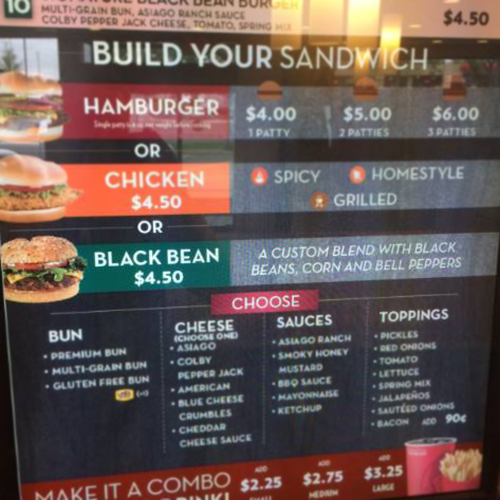

<html>
	<head>
		<meta property="og:type" content="article">
		<meta property="og:url" content="https://act.vegfest.org/veggie-burgers-at-wendys/">
		<meta property="og:image" content="https://act.vegfest.org/veggie-burgers-at-wendys/black-bean-burger.jpg">
		<meta property="og:site_name" content="Try the New Vegan Wendys Black Bean Burger">
		<meta property="og:site_name" content="{{page.title}}">
		<meta property="og:description" content="{{page.description}}">

		<meta name="viewport" content="width=device-width, initial-scale=1">
		<link href='https://fonts.googleapis.com/css?family=Open+Sans:400,300,800' rel='stylesheet' type='text/css'>
		<link rel="stylesheet" href="//netdna.bootstrapcdn.com/bootstrap/3.1.0/css/bootstrap.min.css" />
		<link href="//netdna.bootstrapcdn.com/font-awesome/4.0.3/css/font-awesome.min.css" rel="stylesheet">
		<link rel="stylesheet" href="../leaflet.css" />
		<link rel="stylesheet" href="../style.css" />

	  <!--[if lte IE 8]>
	     <link rel="stylesheet" href="//cdn.leafletjs.com/leaflet-0.5/leaflet.ie.css" />
	  <![endif]-->

	  
	  
	  
		
	</head>
	<body>
		

			<header class="row" id="campaign-header">  
				<h1>Wendy's: We want veggie burgers in our town too!</h1>
				
Wendy's is testing veggie burgers at 24 locations in 3 states: Ohio, Utah, South Carolina. That's great, but we want veggie burgers at all locations.

			</header>

			<section class="row" id="ask">
				

					<h2>Tell Wendy's you want veggie burgers</h2>					

					
Wendy's is currently testing vegan black bean burgers at 24 locations across the country. If you live in Ohio, Utah or South Carolina, go buy a burger to show your support. We need to show Wendy's how much we want vegan options.

					
<strong>Sign now to tell Wendy's that we want veggie burgers everywhere.</strong>

					<form accept-charset="UTF-8" action="https://formkeep.com/f/02515915d774" method="POST" class="form">
						<input type="hidden" name="utf8" value="✓">

						

							<label class="sr-only" for="first_name">First Name</label>
							<input type="text" id="first_name" class="form-control" name="first_name" placeholder="First Name" required>
						

						

							<label class="sr-only" for="last_name">Last Name</label>
							<input type="text" id="last_name" class="form-control" name="last_name" placeholder="Last Name" required>
						

						

							<label class="sr-only" for="email">Your Email</label>
							<input type="email" id="email" class="form-control" name="email" placeholder="Your Email" required>
						

						

							<label class="sr-only" for="zip_code">Zip Code</label>
							<input type="number" id="zip_code" class="form-control" name="zip_code" placeholder="Zip Code" required>
						

						<button type="submit" class="btn btn-lg btn-primary">Sign the Petition</button>					
					</form>

					

						We respect your privacy: <a href="/privacypolicy">Privacy Policy</a>
					

				

			</section>

			

				

					

				
			
				

					<h2>Go get the new veggie burger!</h2>
					

						Do you live near a Wendy's that is testing the burger? Find out below!
						Go visit your local Wendy's and support this initiative. Buy a tasty new
						burger!
					

					

						If the black bean burger does well at these locations, Wendy's may
						roll it out to other stores. If you live near one of these
						locations, please go support it.
					

				

			

			

				

					<h2>Ohio</h2>
					<ul>
						
							<li>
								<i class="fa fa-map-marker"></i>
								<a href="http://maps.google.com/?q={{item.latitude}},{{item.longitude}}">							
									{{item.address}}, {{item.city}}, {{item.state}}
								</a>
							</li>
						
					</ul>
				

				

					<h2>Utah</h2>
					<ul>
						
							<li>
								<i class="fa fa-map-marker"></i>
								<a href="http://maps.google.com/?q={{item.latitude}},{{item.longitude}}">							
									{{item.address}}, {{item.city}}, {{item.state}}
								</a>
							</li>
						
					</ul>
				

				

					<h2>South Carolina</h2>
					<ul>
						
							<li>
								<i class="fa fa-map-marker"></i>
								<a href="http://maps.google.com/?q={{item.latitude}},{{item.longitude}}">							
									{{item.address}}, {{item.city}}, {{item.state}}
								</a>
							</li>
						
					</ul>
				

			

			

				

					<h2>Want to see this near you?</h2>
					

 						Help us tell Wendy's that we want to see this new black bean burger in
						stores near us. Imagine if we all had these nearby!
					

				

		    

		      
		    

		  

		

		

		
  </body>
</html>
